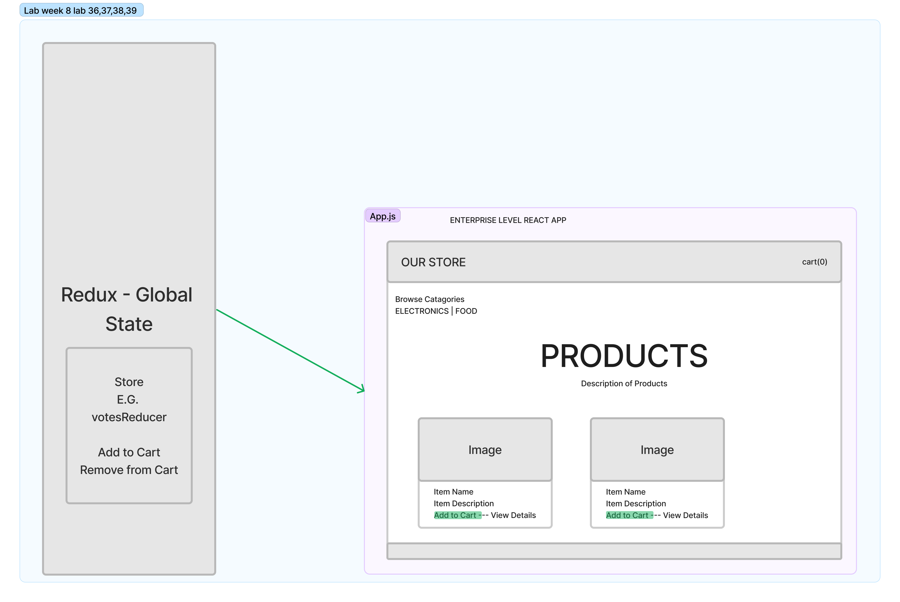
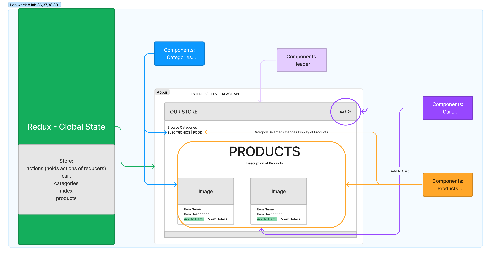

# Project Store Front - Redux

---------------------------------

## We are deployed on _____

[codesandboxURL - phase 1](https://codesandbox.io/p/github/Junyoungson808/storefront/draft/quiet-wood?file=%2FREADME.md&workspace=%257B%2522activeFileId%2522%253A%2522cla7snarh000ol2ey8w3b9u1k%2522%252C%2522openFiles%2522%253A%255B%2522%252FREADME.md%2522%255D%252C%2522sidebarPanel%2522%253A%2522EXPLORER%2522%252C%2522gitSidebarPanel%2522%253A%2522COMMIT%2522%252C%2522sidekickItems%2522%253A%255B%257B%2522type%2522%253A%2522SETUP_SHELL_LOG%2522%252C%2522shellId%2522%253A%2522cla7snax1000rl2ey97pyb10x%2522%252C%2522isMinimized%2522%253Afalse%252C%2522key%2522%253A%2522cla7snax1000rl2ey97pyb10x%2522%257D%252C%257B%2522key%2522%253A%2522cla7sncw3000q356hi67ww5iv%2522%252C%2522type%2522%253A%2522PROJECT_SETUP%2522%252C%2522isMinimized%2522%253Afalse%257D%252C%257B%2522type%2522%253A%2522PREVIEW%2522%252C%2522taskId%2522%253A%2522start%2522%252C%2522port%2522%253A3000%252C%2522key%2522%253A%2522cla7snx0p008k356hsw8165al%2522%252C%2522isMinimized%2522%253Afalse%257D%252C%257B%2522type%2522%253A%2522TASK_LOG%2522%252C%2522taskId%2522%253A%2522start%2522%252C%2522key%2522%253A%2522cla7snuqv006m356hgbm1e2nu%2522%252C%2522isMinimized%2522%253Afalse%257D%255D%257D);

[codesandboxURL - phase 2](https://codesandbox.io/p/github/Junyoungson808/storefront/combined-reducers?file=%2FREADME.md&workspace=%257B%2522activeFileId%2522%253A%2522cla99pkoi0009l1gr07jr55im%2522%252C%2522openFiles%2522%253A%255B%255D%252C%2522sidebarPanel%2522%253A%2522EXPLORER%2522%252C%2522gitSidebarPanel%2522%253A%2522COMMIT%2522%252C%2522sidekickItems%2522%253A%255B%257B%2522type%2522%253A%2522PREVIEW%2522%252C%2522taskId%2522%253A%2522start%2522%252C%2522port%2522%253A3000%252C%2522key%2522%253A%2522cla99q6rk00da356htld9ref0%2522%252C%2522isMinimized%2522%253Afalse%257D%252C%257B%2522type%2522%253A%2522TASK_LOG%2522%252C%2522taskId%2522%253A%2522start%2522%252C%2522key%2522%253A%2522cla99q4dw00b9356hh6tq5q7p%2522%252C%2522isMinimized%2522%253Afalse%257D%255D%257D);

---------------------------------

## Web Application

<!-- ***[Explain your app, should be at least a paragraph. What does it do? Why should I use? Sell your product!]*** -->

An interface is provided to create a website store, view existing products, add to card, and delete from cart. This application is based on redux and how to manage state using redux and redux devtools. With Materuals.UI for styling.

Phase 1:
Build the basic template of the application, Categories & Products, build reducers for each component.
  -As a user, I expect to see a list of available product categories in the store so that I can easily browse products
  -As a user, I want to choose a category and see a list of all available products matching that category
  -As a user, I want a clean, easy to use user interface so that I can shop the online store with confidence

Phase 2:
Add cart component to the application, selected items added to cart must persist in shopping cart, for later purchase.
  -As a user, I want to choose from products in the list and add them to my shopping cart
  -As a user, I want to see the products that I’ve added to my shopping cart so that
  -As a user, I want to change the quantity of items I intend to purchase in my shopping cart
  -As a user, I want to be able to remove an item from my shopping cart

User sees a list of categories
… Chooses a category and sees a list of products
… Clicks the “Add to Cart” button on any product
… Clicks the “Cart” link in the header
… Sees a list of all products in the cart
… Clicks the delete button on an item and sees the item removed
… Changes the quantity selector on an item and sees the cart total change

Phase 3:

Phase 4:

---------------------------------

## Getting Started


```
Packages (npm i)
redux
react-redux
redux-devtools-extension
```

---------------------------------

### Phase 1



### Phase 2




--------------------------- -->

## Authors

Junyoung Son

------------------------------
